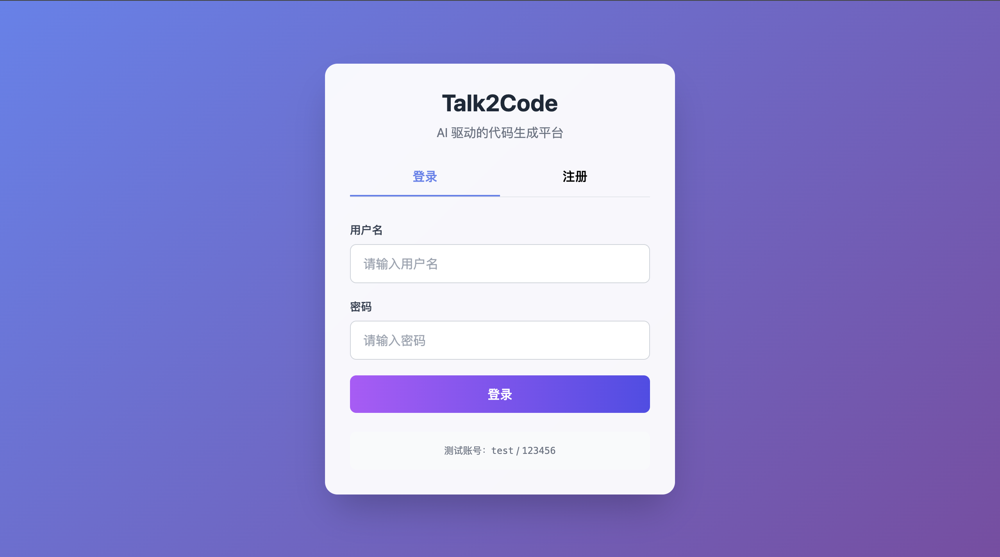
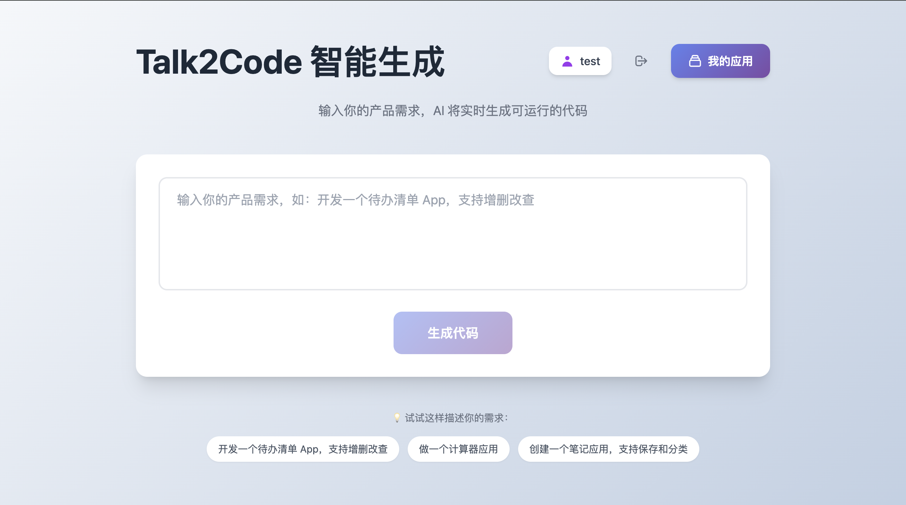
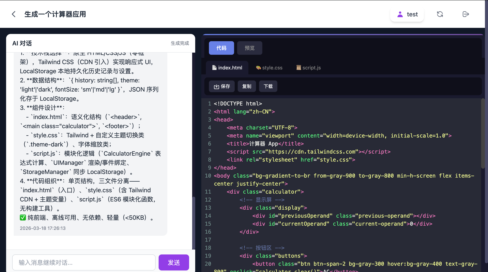
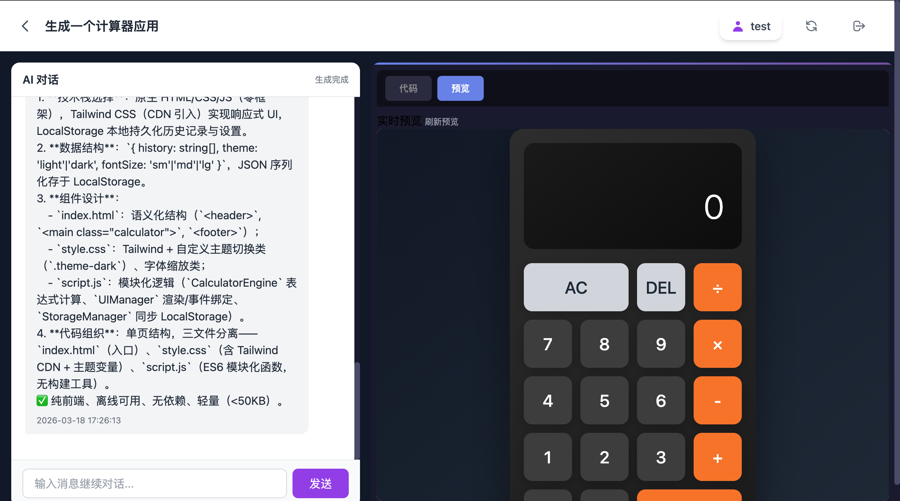

# Talk2Code

一个融合实时代码生成交互风格的 AI 驱动代码生成平台 Demo。

## 核心定位

用户输入自然语言需求 → AI 多智能体协同处理 → 实时生成可运行的产品代码

## 技术栈

- **前端**: HTML5 + CSS3 + JavaScript + Tailwind CSS + CodeMirror
- **后端**: Python 3.8+ + Flask 2.0+
- **数据库**: SQLite
- **实时通信**: SSE (Server-Sent Events)
- **认证**: JWT
- **AI 编排**: LangGraph + LangChain
- **AI 模型**: 阿里云百炼（通义千问）

## 项目结构

```
talk2code/
├── backend/
│   ├── app.py              # Flask 主程序（API、SSE 推送）
│   ├── config.py           # 配置文件（数据库、JWT、SSE、AI 模型）
│   ├── models.py           # 数据库模型（User, Requirement）
│   ├── services/
│   │   ├── requirement_service.py  # 需求管理服务（LangGraph 工作流集成）
│   │   └── sse_manager.py          # SSE 管理器（线程安全的广播）
│   ├── agents/
│   │   ├── state.py        # LangGraph AgentState 定义
│   │   ├── nodes.py        # 智能体节点函数（研究员/产品经理/架构师/工程师）
│   │   └── workflow.py     # LangGraph StateGraph 工作流定义
│   ├── llm/
│   │   └── client.py       # 统一 LLM 客户端（DashScope API，支持重试）
│   ├── prompts/
│   │   └── prompts.py      # 系统提示词模板
│   └── utils/
│       ├── logger.py       # 日志工具
│       ├── sse.py          # SSE 消息格式化
│       ├── retry.py        # 指数退避重试
│       └── rate_limiter.py # 限流器
└── frontend/
    ├── login.html          # 登录/注册页
    ├── index.html          # 首页（需求输入、我的应用列表）
    └── detail.html         # 需求详情页（AI 对话 + 代码编辑器 + 持续对话）
```

## 快速开始

### 1. 安装依赖

```bash
cd backend
pip install -r requirements.txt
```

### 2. 配置环境变量

**重要**：需要配置阿里云百炼 API Key 才能使用 AI 功能。

在 `backend/` 目录下创建 `.env` 文件（可参考 `.env.example` 模板）：

```bash
# 阿里云百炼大模型 API Key
DASHSCOPE_API_KEY=your_api_key_here

# 模型选择（可选）
DASHSCOPE_MODEL=qwen-plus
```

**获取 API Key**: 访问 [阿里云百炼控制台](https://bailian.console.aliyun.com/) 申请。

### 3. 启动服务

```bash
python app.py
```

服务启动后访问：http://localhost:5001/login.html

### 4. 测试账号

- 用户名：`test`
- 密码：`123456`

## 使用流程

1. **登录** - 使用测试账号或注册新账号
2. **输入需求** - 在首页输入框描述你的需求，或点击"我的应用"查看历史创建
   - 示例：`开发一个待办清单 App，支持增删改查`
   - 示例：`做一个计算器应用`
   - 示例：`创建一个笔记应用`
3. **查看生成** - 进入详情页后：
   - **左侧**: 观看 AI 多智能体（研究员→产品经理→架构师→工程师）协同讨论
   - **右侧**: 实时查看代码生成（支持代码/预览 TAB 切换）
4. **持续对话** - 生成完成后，可在左侧 AI 对话面板底部输入框继续与 AI 对话
5. **预览与下载** - 切换到"预览"TAB 实时查看效果，或复制/下载代码文件

## 核心功能

### 用户系统
- 用户注册/登录（JWT 认证）
- 登录状态持久化
- 未登录拦截

### 我的应用
- 查看用户创建的所有应用列表
- 显示应用状态（处理中/生成中/已完成/失败）
- 点击快速跳转到应用详情

### AI 多智能体协同

基于 **LangGraph** 实现的工作流编排，4 个智能体按顺序协同：

```
┌─────────────┐     ┌─────────────┐     ┌─────────────┐     ┌─────────────┐
│  研究员     │────▶│  产品经理   │────▶│  架构师     │────▶│  工程师     │
│  市场分析   │     │  功能拆解   │     │  技术设计   │     │  代码生成   │
└─────────────┘     └─────────────┘     └─────────────┘     └─────────────┘
```

### 工作流程

1. **研究员节点** (`researcher_node`)
   - 分析市场需求和可行性
   - 输出：市场与需求分析报告

2. **产品经理节点** (`product_manager_node`)
   - 拆解功能清单和交互逻辑
   - 输出：产品功能规划

3. **架构师节点** (`architect_node`)
   - 设计技术架构和数据结构
   - 输出：技术架构设计方案

4. **工程师节点** (`engineer_node`)
   - 生成可运行的代码文件
   - 输出：代码文件列表（JSON 格式）

### LangGraph StateGraph

```python
# 状态定义 (AgentState)
class AgentState(TypedDict):
    requirement_id: int           # 需求 ID
    requirement_content: str      # 需求内容
    agent_outputs: List[dict]     # 智能体输出（自动累积）
    current_step: str             # 当前步骤
    code_files: Optional[List]    # 生成的代码文件
    error: Optional[str]          # 错误信息
    dialogue_history: List[dict]  # 对话历史（自动累积）
    metadata: dict                # 元数据
```

### 错误处理

- 每个节点独立的 fallback 机制
- 架构师失败后工程师使用降级方案
- JSON 解析失败时生成模板代码

### 持续对话
- 会话历史持久化到数据库
- 支持多轮对话，AI 记住上下文
- 刷新页面不丢失对话记录

### 代码编辑器
- CodeMirror 语法高亮
- 多文件切换（HTML/CSS/JS）
- 实时预览（iframe 沙箱隔离）
- 复制/下载功能

### 数据持久化
- SQLite 存储用户数据
- 对话历史完整保存
- 代码文件完整保存
- 刷新页面数据恢复

## API 接口

| 接口 | 方法 | 说明 |
|------|------|------|
| /api/register | POST | 用户注册 |
| /api/login | POST | 用户登录 |
| /api/requirements | POST | 创建需求 |
| /api/requirements | GET | 获取需求列表 |
| /api/requirements/<id> | GET | 获取需求详情 |
| /api/requirements/<id>/chat | POST | 发送对话消息（持续对话） |
| /api/sse/<id> | GET | SSE 实时推送连接 |

## 支持的应用类型

- **待办清单 App** (输入包含"待办"、"todo"或"清单")
- **计算器 App** (输入包含"计算器"或"计算")
- **笔记 App** (输入包含"笔记"或"备忘录")
- **通用应用** (其他需求)

## 界面预览

### 登录页面


### 首页（已登录）


### 需求详情页


### 需求详情页（预览）

---

**页面说明**:
- **登录页**: 支持登录/注册切换，测试账号 `test / 123456`
- **首页**: 输入产品需求，AI 实时生成可运行代码
- **详情页**: 左侧 AI 多智能体协同讨论，右侧代码/预览实时切换

## 注意事项

1. 这是一个 Demo 项目，AI 智能体使用预设的 prompt 模板
2. 生产环境请配置环境变量 `DASHSCOPE_API_KEY` 接入真实 AI 模型
3. JWT 密钥请生产环境使用环境变量 `JWT_SECRET_KEY` 配置
4. 建议使用现代浏览器（Chrome/Edge/Safari）
5. 基于 LangGraph 的多智能体工作流支持错误降级和 fallback 机制
