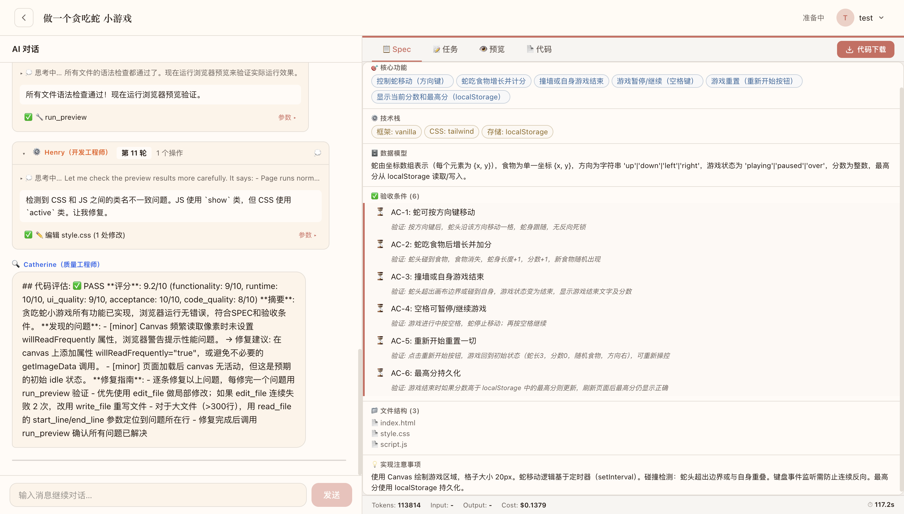

<p align="center">
  
</p>

# Talk2Code

一个 AI 驱动的一站式网站生成平台，用户输入自然语言需求 → AI 多智能体协同处理 → 实时生成可运行的产品代码。


## 技术栈

- **前端**: Vue 3 + TypeScript + Vite
- **后端**: Python 3.11+ + Flask + LangGraph
- **数据库**: SQLite
- **实时通信**: SSE (Server-Sent Events)
- **认证**: JWT
- **AI 模型**: 兼容 OpenAI/Anthropic 接口协议，配置驱动切换
- **向量检索**: BGE-M3 混合检索

## 项目结构

```
talk2code/
├── backend/
│   ├── app.py                    # Flask 主程序（API 路由、SSE 推送）
│   ├── config.py                 # 配置管理
│   ├── models/                   # 数据模型
│   ├── llm/                      # LLM 统一客户端（OpenAI/Anthropic 双协议）
│   ├── harness/                  # Agent 运行时框架
│   │   ├── instructions/         #   LLM 指令与 Prompt 管理
│   │   │   ├── compactor.py     #     上下文压缩（支持 preserve 标记保护关键消息）
│   │   │   ├── skill_loader.py  #     声明式 Skill 加载（manifest.json 触发）
│   │   │   └── nodes.py         #     LangGraph 节点（支持 Agent 委派）
│   │   ├── tools/                #   工具注册表（ToolHandler + @register_tool 装饰器）
│   │   ├── state/                #   状态管理 / 工作区 / 记忆系统
│   │   ├── constraints/          #   Hook 与质量约束
│   │   ├── events.py             #   类型化事件模型（Pydantic）
│   │   ├── plugins/              #   插件系统（.talk2code-plugin/plugin.json）
│   │   └── observability/        #   追踪 / Token 成本 / SSE 上报
│   ├── services/                 # SSE 传输、任务队列
│   └── utils/                    # 限流、重试、安全工具
├── frontend-vue/                 # Vue 3 + TypeScript 前端
│   └── src/
│       ├── components/           # UI 组件
│       ├── views/                # 页面视图
│       ├── composables/          # 组合式函数
│       ├── stores/               # Pinia 状态管理
│       └── router/               # 路由配置
├── start.sh                      # 一键启动脚本
└── openspec/                     # OpenSpec 规范驱动开发
```

## 快速开始

### 1. 安装依赖

```bash
python -m venv venv
source venv/bin/activate
pip install -r backend/requirements.txt
```

### 2. 配置 LLM

复制配置模板并填入你的 API Key：

```bash
cp backend/.env.example backend/.env
# 编辑 backend/.env，填入 LLM_API_KEY
```

支持两种协议，通过 `LLM_PROVIDER` 切换：

| 协议 | 适用服务商 |
|------|-----------|
| `openai_compatible` | DeepSeek、DashScope、OpenAI、智谱、月之暗面 等 |
| `anthropic_compatible` | Anthropic Claude 等 |

```bash
# OpenAI 兼容示例（DeepSeek）
LLM_PROVIDER=openai_compatible
LLM_BASE_URL=https://api.deepseek.com
LLM_MODEL=deepseek-v4-flash
LLM_API_KEY=your-api-key-here
```

### 3. 启动服务

**方式一：一键启动**

```bash
./start.sh
```

**方式二：手动启动**

```bash
# 构建前端
cd frontend-vue && npm install && npm run build && cd ..

# 启动后端
cd backend && python app.py
```

访问 http://localhost:5001

### 4. 测试账号

- 用户名：`test`
- 密码：`123456`

## 界面截图

### 首页 — 需求输入


### 详情页 — 代码 + 对话 + 预览


### 预览 — 浏览器实时运行


### 预览 — Spec


### 历史对话


## 核心功能

### AI 多智能体协同

基于 LangGraph v5 编排的 3 节点 Agent 工作流，前置意图分类器做智能分流。

| Agent | 角色 | 职责 |
|-------|------|------|
| **TeamLeader** | Leon（技术负责人） | 需求分析 → 结构化 Plan → 复杂度分级（simple/standard） |
| **Coder** | Henry（开发工程师） | 批量创建文件 + 自适应迭代上限（文件数驱动），write_file 返回内容预览避免回读 |
| **Verify** | Catherine（质量工程师） | Playwright 真实浏览器 AC 逐条验收 → 快速通道（全部通过则跳过 LLM 评估） |

**两种复杂度 SOP**，由 TeamLeader 自动判断：

| 等级 | 触发条件 | 流程 |
|------|---------|------|
| 🟢 **simple** | 单个 HTML 页面、极简交互 | `TeamLeader` 轻量分析 → `Coder` 5 轮快速通道 → `run_preview` 验证 → 完成 |
| 🔵 **standard** | 多文件、交互式应用 | `TeamLeader` 完整 Plan + AC → 用户确认 → `Coder` 批量创建（文件数×2+3 轮）→ `Verify` AC 逐条验收 → 1 轮修复 → PASS 或 finished_with_issues |

### 代码质量验收系统

Verify 节点采用 **Playwright 真实浏览器执行 + LLM 评估** 双层验证：

**L3 交互式验收**（新增）：
- LLM 将每条验收条件翻译为 Playwright DOM 操作序列（type/click/assert_exists...）
- 在 headless Chromium 中逐条执行，收集 passed/failed/截图
- 全部 AC 通过 + preview 零错误 → **快速通道 PASS**（跳过 LLM 深度评估）
- 结果实时推送到前端 Spec 面板（AC 级别 ✅/❌）

**L2 深度评估**（AC 未全通过时触发）：
- 双视角 LLM 评估（功能正确性 + 代码/UI 质量），5 维度 1-10 分
- 综合评分 ≥ 6 且无 critical 问题 → PASS
- 未通过 + 1 轮修复后仍不达标 → **finished_with_issues**（保留代码产物）

### 上下文效率优化

- **write_file 返回内容预览**：写入后返回前 80 行 + 尾 10 行，Agent 无需 read_file 验证
- **PRE_TOOL_USE Hook 真阻断**：写入后 2 轮内实际阻止对同一文件的回读
- **批量文件创建**：允许一次创建 2-3 个相关文件，消除"每次一个文件"的串行瓶颈
- **迭代上限文件数驱动**：3 文件 = 9 轮，5 文件 = 13 轮，按需分配不浪费

### 记忆系统

跨会话经验积累 — AI 会在任务前检索相关历史经验辅助编码，任务后自动总结关键模式供后续复用，持续优化生成质量。

### 快速问答

简单技术问题走快速通道，直接回答不进入编码流水线，节省 Token 和响应时间。

## 注意事项

1. 项目仍在迭代中，欢迎 Issue / PR 一同共创
2. 需要在 `.env` 中配置 `LLM_API_KEY` 才能使用 AI 功能
3. **安全配置（必读）**：
   - 生产环境必须配置强随机 `JWT_SECRET_KEY`（`python -c "import secrets; print(secrets.token_urlsafe(48))"`）。
     使用默认密钥且服务对外可达（非 debug 或监听 `0.0.0.0`）时，应用会**拒绝启动**；
     仅限无法配置密钥的隔离演示环境可显式设 `ALLOW_INSECURE_SECRETS=true` 豁免。
   - 默认开启 API 限流（`DISABLE_RATE_LIMIT=false`）；测试套件由 conftest 自行注入关闭。
   - 未部署在可信反向代理之后时，请勿开启 `TRUST_PROXY_HEADERS=true`（否则限流 IP 可被伪造）。
   - 登录令牌只通过 httpOnly cookie 下发，前端不存储 token。
4. 预览能力 URL 默认使用同源相对路径；若前后端不同域部署，配置 `PREVIEW_PUBLIC_BASE_URL`
   指向预览入口（如 `https://preview.example.com`）。
5. 建议使用现代浏览器（Chrome/Edge/Safari）
6. 前端开发模式：`cd frontend-vue && npm run dev` 启动 Vite 热更新开发服务器
7. README 中出现的 `test / 123456` 仅为本地演示账号，生产环境请删除或替换
