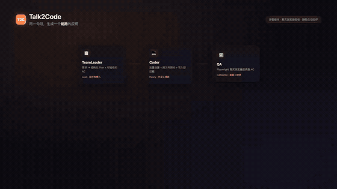
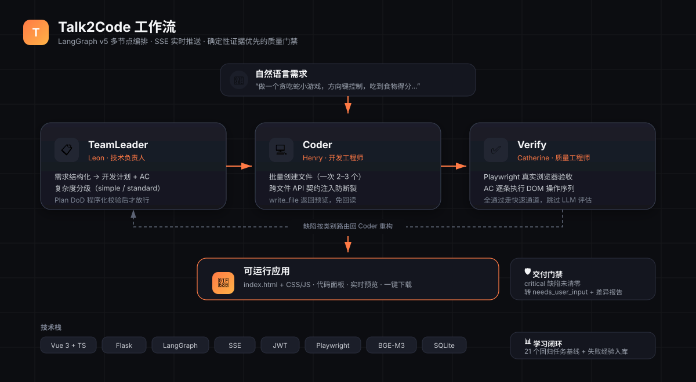

<p align="center">
  
</p>

<h1 align="center">Talk2Code</h1>

<p align="center">
  <b>用一句话，生成一个能跑的应用。</b>
</p>

<p align="center">
  输入自然语言需求 → AI 多智能体协同（需求分析 / 批量编码 / 真实浏览器验收）→ 实时产出可运行、可下载的产品代码。
</p>

<p align="center">
  <a href="https://github.com/WowCoder/talk2code/actions/workflows/ci.yml"></a>
  
  
  
  
</p>

<p align="center">
  
</p>

<p align="center">
  🎬 <a href="https://github.com/WowCoder/talk2code/blob/main/docs/talk2code_pitch.mp4">观看高清视频（MP4）</a>
  &nbsp;·&nbsp; 📐 <a href="#架构一览">架构一览</a>
  &nbsp;·&nbsp; ⚡ <a href="#快速开始">3 步跑起来</a>
</p>

**一句话看懂 Talk2Code：**
- 🗣️ **说人话就能出活**：一句需求 → 多智能体协同产出可运行、可下载的应用
- 🤖 **三个角色分工**：技术负责人定方案、开发工程师写代码、质量工程师真机验收
- ✅ **真实验收，不是摆设**：Playwright 在真实浏览器里逐条跑验收条件
- 🚦 **交付门禁**：关键缺陷清零才放行，杜绝「能跑就行」
- 🔁 **越用越聪明**：21 个回归任务 + 跨会话记忆，踩过的坑不再踩

## 📑 目录

- [为什么不一样](#为什么不一样)
- [技术栈](#技术栈)
- [架构一览](#架构一览)
- [项目结构](#项目结构)
- [快速开始](#快速开始)
- [界面截图](#界面截图)
- [核心功能](#核心功能)
- [注意事项](#注意事项)
- [路线图](#路线图)
- [License](#license)
- [贡献](#贡献)

---

## 为什么不一样

多数「AI 写代码」工具止步于吐出一堆片段。Talk2Code 把<b>工程质量</b>当成一等公民：

| 能力 | 做法 |
|------|------|
| 🧠 多智能体分工 | LangGraph 编排 技术负责人 / 开发工程师 / 质量工程师，职责分离而非一次生成了事 |
| ✅ 真实验收 | 质量工程师用 Playwright 在 headless Chromium 里逐条执行 AC，不是「看着像对的」 |
| 🛡️ 交付门禁 | critical 缺陷未清零不放行，转 `needs_user_input` 并附差异报告 |
| 🔗 跨文件契约 | 计划期声明 exports → 编码期契约注入 → 验收期闭合校验，杜绝「按钮静默失效」 |
| 🚫 写入即拦截 | PRE_WRITE Hook 零 LLM 成本拦掉 `type="module"` / 外部 CDN 等沙箱必炸写法 |
| 🔁 缺陷自动回炉 | 验收不通过按缺陷类别路由回 Coder 重构，架构类附根因卡片，修完再验 |
| 📊 回归纪律 | 固化 21 个回归任务（含贪吃蛇失败模式专项），改核心前后跑基线对照；失败经验入库 |

## 技术栈

- **前端**: Vue 3 + TypeScript + Vite
- **后端**: Python 3.11+ + Flask + LangGraph
- **数据库**: PostgreSQL + pgvector（`docker compose up -d` 一键起）；未配置 `DATABASE_URL` 时自动回退 SQLite
- **实时通信**: SSE (Server-Sent Events)
- **认证**: JWT
- **异步任务**: Celery + Redis（需求生成异步化，避免阻塞请求）
- **AI 模型**: 兼容 OpenAI/Anthropic 接口协议，配置驱动切换
- **向量检索**: BGE-M3 混合检索

## 架构一览

<p align="center">
  
</p>

## 项目结构

```
talk2code/
├── backend/
│   ├── app.py                    # 应用入口（装配 factory.app + 注册路由蓝图）
│   ├── factory.py                # Flask 应用工厂（app 实例 / CORS / JWT / 限流 / SSE 与任务队列装配）
│   ├── config.py                 # 配置管理
│   ├── routes/                   # API 路由蓝图（auth / requirements / preview / health）
│   ├── celery_app.py             # Celery 异步任务定义
│   ├── models/                   # 数据模型
│   ├── llm/                      # LLM 统一客户端（OpenAI/Anthropic 双协议）
│   ├── harness/                  # Agent 运行时框架
│   │   ├── instructions/         #   LLM 指令与 Prompt 管理
│   │   │   ├── compactor.py     #     上下文压缩（支持 preserve 标记保护关键消息）
│   │   │   ├── skill_loader.py  #     声明式 Skill 加载（manifest.json 触发，knowledge/workflow 双类型）
│   │   │   ├── prompts/skills/  #     9 个技能：6 knowledge（generic/color/typography/accessibility/anti-ai-slop/game）
│   │   │   │                    #     + 3 workflow（scaffold 脚手架 / refactor 重构 / code_review 前端审查，可被 run_skill 调用组合）
│   │   │   └── nodes.py         #     LangGraph 节点（支持 Agent 委派）
│   │   ├── tools/                #   工具注册表（ToolHandler + @register_tool 装饰器）
│   │   │   └── skill_tools.py    #     run_skill：Agent 可调用/组合工作流技能的入口
│   │   ├── state/                #   状态管理 / 工作区 / 记忆系统
│   │   ├── constraints/          #   Hook 与质量约束
│   │   ├── events.py             #   类型化事件模型（Pydantic）
│   │   ├── plugins/              #   插件系统（.talk2code-plugin/plugin.json）
│   │   └── observability/        #   追踪 / Token 成本 / SSE 上报
│   ├── services/                 # SSE 传输、任务队列
│   └── utils/                    # 限流、重试、安全工具
├── frontend-vue/                 # Vue 3 + TypeScript 前端
│   └── src/
│       ├── components/           # UI 组件
│       ├── views/                # 页面视图
│       ├── composables/          # 组合式函数
│       ├── stores/               # Pinia 状态管理
│       └── router/               # 路由配置
├── start.sh                      # 一键启动脚本
└── openspec/                     # OpenSpec 规范驱动开发
```

## 快速开始

### 1. 安装依赖

```bash
python -m venv venv
source venv/bin/activate
pip install -r backend/requirements.txt
```

### 2. 配置 LLM

复制配置模板并填入你的 API Key：

```bash
cp backend/.env.example backend/.env
# 编辑 backend/.env，填入 LLM_API_KEY
```

支持两种协议，通过 `LLM_PROVIDER` 切换：

| 协议 | 适用服务商 |
|------|-----------|
| `openai_compatible` | DeepSeek、DashScope、OpenAI、智谱、月之暗面 等 |
| `anthropic_compatible` | Anthropic Claude 等 |

```bash
# OpenAI 兼容示例（DeepSeek）
LLM_PROVIDER=openai_compatible
LLM_BASE_URL=https://api.deepseek.com
LLM_MODEL=deepseek-v4-flash
LLM_API_KEY=your-api-key-here
```

### 3. 启动服务

**方式一：一键启动**

```bash
./start.sh
```

**方式二：手动启动**

```bash
# 构建前端
cd frontend-vue && npm install && npm run build && cd ..

# 启动后端
cd backend && python app.py
```

访问 http://localhost:5001

### 4. 测试账号

- 用户名：`test`
- 密码：`123456`

## 界面截图

### 首页 — 需求输入


### 详情页 — 代码 + 对话 + 预览


### 预览 — 浏览器实时运行


### 预览 — Spec


### 历史对话


## 核心功能

### AI 多智能体协同

基于 LangGraph（v1.x，当前 1.1.10）编排的 3 节点 Agent 工作流，前置意图分类器做智能分流。

| Agent | 角色 | 职责 |
|-------|------|------|
| **TeamLeader** | Leon（技术负责人） | 需求分析 → 结构化 Plan → 复杂度分级（simple/standard） |
| **Coder** | Henry（开发工程师） | 批量创建文件 + 自适应迭代上限（文件数驱动），write_file 返回内容预览避免回读 |
| **QA** | Catherine（质量工程师） | Playwright 真实浏览器 AC 逐条验收 → 快速通道（全部通过则跳过 LLM 评估） |

**两种复杂度 SOP**，由技术负责人自动判断：

| 等级 | 触发条件 | 流程 |
|------|---------|------|
| 🟢 **simple** | 单个 HTML 页面、极简交互 | `技术负责人` 轻量分析 → `开发工程师` 5 轮快速通道 → `run_preview` 验证 → 完成 |
| 🔵 **standard** | 多文件、交互式应用 | `技术负责人` 完整 Plan + AC（DoD 程序化校验）→ 用户确认 → `开发工程师` 批量创建（文件数驱动轮数）→ `质量工程师` AC 逐条验收 → 按缺陷类别路由修复 → PASS / needs_user_input（交付门禁）|

更完整的工程质量体系在 [架构与设计](docs/ARCHITECTURE.md) 中展开，包含：

- **确定性验收**：L0 环境契约（写入即拦截）/ L2 深度评估 / L3 交互式验收
- **交付门禁**与缺陷按类别自动回炉
- **跨文件 API 契约**（导出闭合，杜绝按钮静默失效）
- **Plan DoD 校验**与上下文效率优化
- **记忆系统**与 21 个回归任务的**学习闭环**

## 注意事项

1. 项目仍在迭代中，欢迎 Issue / PR 一同共创
2. 需要在 `.env` 中配置 `LLM_API_KEY` 才能使用 AI 功能
3. **安全配置（必读）**：
   - 生产环境必须配置强随机 `JWT_SECRET_KEY`（`python -c "import secrets; print(secrets.token_urlsafe(48))"`）。
     使用默认密钥且服务对外可达（非 debug 或监听 `0.0.0.0`）时，应用会**拒绝启动**；
     仅限无法配置密钥的隔离演示环境可显式设 `ALLOW_INSECURE_SECRETS=true` 豁免。
   - 默认开启 API 限流（`DISABLE_RATE_LIMIT=false`）；测试套件由 conftest 自行注入关闭。
   - 未部署在可信反向代理之后时，请勿开启 `TRUST_PROXY_HEADERS=true`（否则限流 IP 可被伪造）。
   - 登录令牌只通过 httpOnly cookie 下发，前端不存储 token。
4. 预览能力 URL 默认使用同源相对路径；若前后端不同域部署，配置 `PREVIEW_PUBLIC_BASE_URL`
   指向预览入口（如 `https://preview.example.com`）。
5. 建议使用现代浏览器（Chrome/Edge/Safari）
6. 前端开发模式：`cd frontend-vue && npm run dev` 启动 Vite 热更新开发服务器
7. README 中出现的 `test / 123456` 仅为本地演示账号，生产环境请删除或替换
8. **冷启动兼容性**：部分 OpenAI 兼容端点（如 agnes）强制要求 messages 中至少有一条 `user` 消息，
   否则首轮请求返回 400（`No user query found in messages.`）。`harness/runtime.py` 的
   `_build_messages()` 在对话历史为空（冷启动）时自动补一条 user 消息，生产环境因需求本就
   作为 user 消息进入历史而 no-op，零副作用。
9. **LLM 流量诊断**：`logs/llm_traffic.log`（仓库根目录，非 `backend/logs`）为 JSON Lines 格式，
   按天轮转保留 7 天，每条含完整请求/响应体，可用于定位 400/500 等端点校验问题。

## 路线图

- 更多智能体角色与专用工具（数据库 / API 集成智能体）
- 多轮对话式迭代与「用户在环」精细调优
- 企业级部署：水平扩展、鉴权与审计
- 更多前端框架模板与组件库技能

## License

本项目采用 [MIT License](LICENSE)。

## 贡献

欢迎 Issue / PR。涉及核心 harness 改动前，建议先跑回归基线（`eval/run_eval.py --no-preview`）前后对照，详见 [架构与设计](docs/ARCHITECTURE.md) 与 [OpenSpec](openspec/)。
