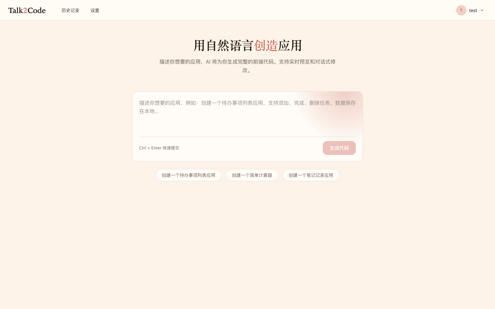
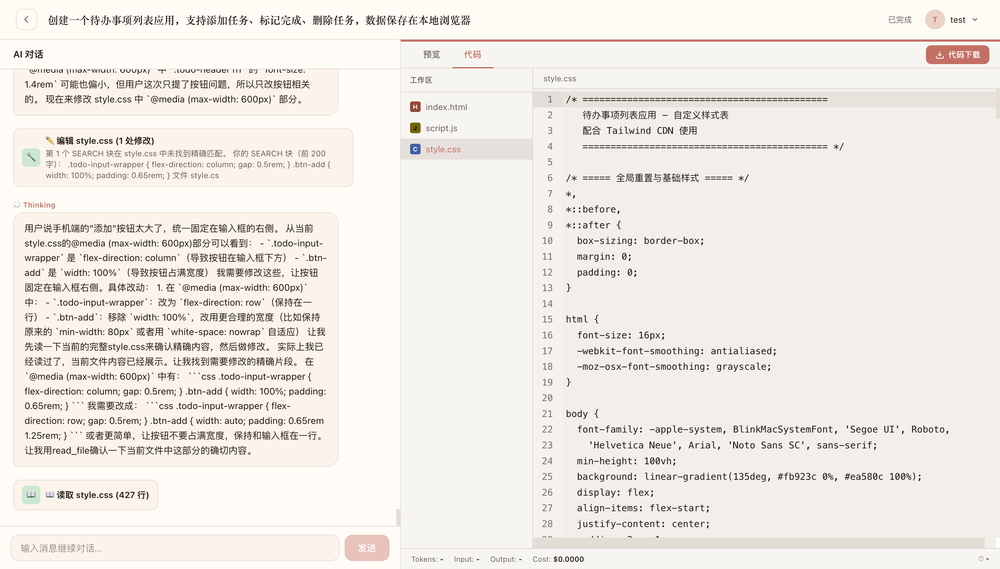
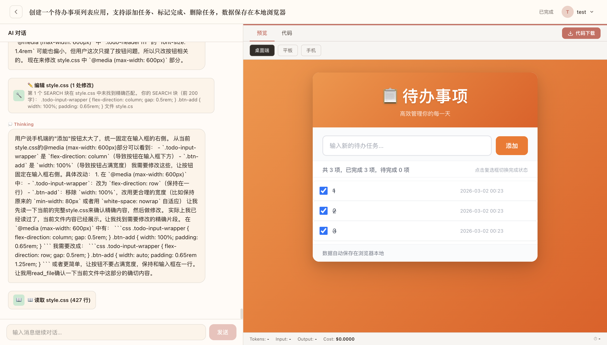
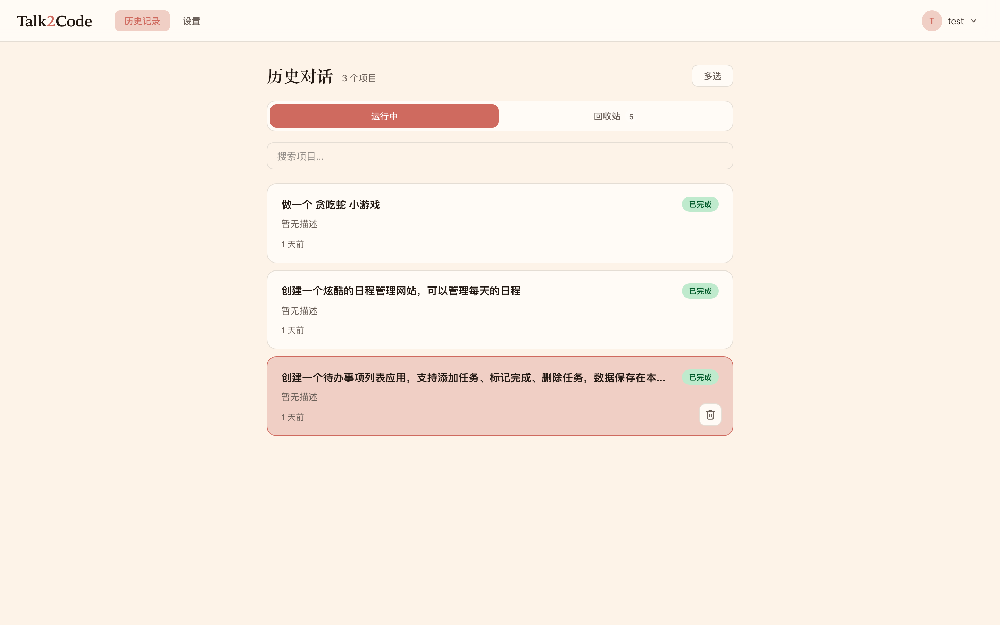
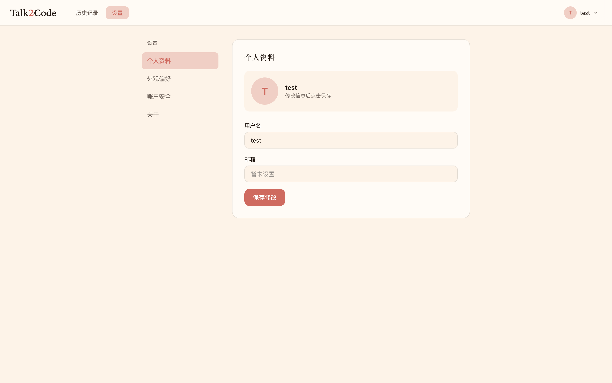

# Talk2Code

一个 AI 驱动的一站式网站生成平台，用户输入自然语言需求 → AI 多智能体协同处理 → 实时生成可运行的产品代码。



## 技术栈

- **前端**: Vue 3 + TypeScript + Vite + Warm Soft 设计系统 (OKLch)
- **后端**: Python 3.11+ + Flask
- **数据库**: SQLite
- **实时通信**: SSE (Server-Sent Events)
- **认证**: JWT
- **AI 编排**: LangGraph
- **AI 模型**: 兼容 OpenAI/Anthropic 接口协议，配置驱动切换
- **向量检索**: BGE-M3 (FlagEmbedding) — Dense + Sparse 混合检索

## 项目结构

```
talk2code/
├── backend/
│   ├── app.py                          # Flask 主程序（API 路由、SSE 推送）
│   ├── config.py                       # Pydantic 配置（数据库、JWT、SSE、LLM）
│   ├── requirements.txt                # Python 依赖
│   ├── .env.example                    # LLM 配置模板
│   ├── models/                         # SQLAlchemy 数据模型 + Schema
│   ├── llm/
│   │   └── client.py                   # 统一 LLM 客户端（OpenAI/Anthropic 双协议）
│   ├── harness/                        # Agent 运行时框架（6 层架构）
│   │   ├── runtime.py                  # ReAct 工具调用循环 — Agent 执行引擎
│   │   ├── graph.py                    # LangGraph 工作流 v5（3 节点编排，QA 反馈作为对话注入）
│   │   ├── agent_names.py              # Agent 名称常量（全局唯一来源）
│   │   ├── harness_context.py          # Harness 对象线程局部存储
│   │   ├── instructions/               # LLM 指令：提示词、节点函数、意图路由、上下文组装/压缩
│   │   │   ├── prompts/                #   统一 Prompt 管理（.md 文件 + load_prompt 工具函数）
│   │   │   │   ├── coding/             #     编码 Prompt（XS/S/M/L + chat + file_aware + tl_analysis）
│   │   │   │   ├── review/             #     审查 Prompt（code_review + summarize）
│   │   │   │   ├── verify/             #     评估 Prompt（evaluator）
│   │   │   │   ├── intent/             #     意图分类 + 快速问答 Prompt
│   │   │   │   ├── memory/             #     记忆反思/验证/合并 Prompt
│   │   │   │   ├── skills/             #     设计规则 Skill（L0-L2 渐进式披露 + Skill 选择器）
│   │   │   │   └── tasks/              #     任务模板 Prompt
│   │   │   ├── intent_router.py        #   前置意图分类 (QUICK/SEARCH/TASK/AMBIGUOUS)
│   │   │   ├── nodes.py                #   LangGraph 节点函数（TL/Coder/Verify/Repair）
│   │   │   ├── file_coder.py           #   M/L 逐文件编码循环 + LGTM/LBTM 审查
│   │   │   ├── compactor.py            #   P0-P3 分层上下文压缩
│   │   │   └── assembler.py            #   上下文组装（Skill + Craft 规则 + 记忆注入）
│   │   ├── tools/                      # 工具注册表、文件读写/编辑、代码验证、预览运行、Web 搜索
│   │   ├── learning/                   # 学习模块（预留）
│   │   ├── experience/                 # 经验池 (DEPRECATED → state/memory.py)
│   │   ├── environment/                # 沙箱安全执行环境
│   │   ├── state/                      # AgentState、WorkspaceFS、Git 版本化、记忆、检查点
│   │   │   ├── agent_state.py          #   AgentState — 工作流全局状态定义
│   │   │   ├── workspace.py            #   WorkspaceFS — 沙箱文件系统管理
│   │   │   ├── versioning.py           #   GitVersioning — 文件变更版本追踪
│   │   │   ├── checkpoint.py           #   CheckpointManager — 断点续传
│   │   │   ├── memory.py               #   MemoryManager — BGE-M3 混合检索 + LLM 反思记忆
│   │   │   ├── memory_retriever.py     #   BGEM3Retriever — Dense+Sparse 向量检索 + 降级回退
│   │   │   └── memory_store.py         #   MemoryStore (DEPRECATED → memory.py)
│   │   ├── constraints/                # Hook 管理器 + CompletionContract + 进度约束 + 安全检查
│   │   │   ├── hooks.py                #   HookManager — 生命周期事件管理
│   │   │   ├── checks.py               #   Craft 规则/安全/质量 Hook + 进度约束 Hook
│   │   │   ├── completion_contract.py  #   CompletionContract — Default-FAIL 检查清单
│   │   │   └── progress_hooks.py       #   进度约束 Hook（防回读 + task_complete 阻断）
│   │   └── observability/              # 链路追踪、Token 成本统计、SSE 事件上报、日志
│   │       ├── tracer.py               #   链路追踪（LangChain/LangGraph 集成）
│   │       ├── cost.py                 #   Token 用量与成本统计
│   │       ├── sse_reporter.py         #   Agent 事件 → SSE 消息转换
│   │       └── logger.py               #   统一日志
│   ├── agents/                         # 向后兼容重导出层（核心逻辑已迁移至 harness/）
│   ├── services/                       # SSE 传输、任务队列、业务胶水层
│   └── utils/                          # 限流、重试、安全、SSE 格式化
├── frontend-vue/                       # Vue 3 + TypeScript 前端
│   ├── src/
│   │   ├── components/                 # UI 组件
│   │   │   ├── auth/                   #   登录/注册/Tab 切换
│   │   │   ├── common/                 #   通用组件（按钮/头像/状态徽章/确认框/Toast）
│   │   │   ├── detail/                 #   详情页组件（代码/对话/预览/任务/Spec/进度/Token）
│   │   │   ├── history/                #   历史页组件（项目列表/搜索/分页/空状态）
│   │   │   ├── home/                   #   首页组件（Hero/需求输入/示例标签）
│   │   │   ├── layout/                 #   布局组件（导航栏）
│   │   │   └── settings/               #   设置页组件（Profile/外观/账号/关于）
│   │   ├── views/                      # 页面视图（Home/Login/Detail/History/Settings）
│   │   ├── composables/                # 组合式函数（useApi/useSSE/useDarkMode/useToast）
│   │   ├── stores/                     # Pinia 状态管理（auth/requirement/settings）
│   │   ├── types/                      # TypeScript 类型定义（api/sse）
│   │   └── router/                     # Vue Router 路由
│   └── dist/                           # 构建产物（由 Flask 托管）
├── start.sh                            # 一键启动脚本
└── openspec/                           # OpenSpec 规范驱动开发
```

## 快速开始

### 1. 安装依赖

```bash
python -m venv venv
source venv/bin/activate
pip install -r backend/requirements.txt
```

### 2. 配置 LLM

复制配置模板并填入你的 API Key：

```bash
cp backend/.env.example backend/.env
# 编辑 backend/.env，填入 LLM_API_KEY
```

支持两种协议，通过 `LLM_PROVIDER` 切换：

| 协议 | 适用服务商 |
|------|-----------|
| `openai_compatible` | DeepSeek、DashScope、OpenAI、智谱、月之暗面 等 |
| `anthropic_compatible` | Anthropic Claude 等 |

```bash
# OpenAI 兼容示例（DeepSeek）
LLM_PROVIDER=openai_compatible
LLM_BASE_URL=https://api.deepseek.com
LLM_MODEL=deepseek-v4-flash
LLM_API_KEY=your-api-key-here
```

### 3. 启动服务

**方式一：一键启动**

```bash
./start.sh
```

**方式二：手动启动**

```bash
# 构建前端
cd frontend-vue && npm install && npm run build && cd ..

# 启动后端
cd backend && python app.py
```

访问 http://localhost:5001

### 4. 测试账号

- 用户名：`test`
- 密码：`123456`

## 界面截图

### 首页 — 需求输入


### 详情页 — 代码 + 对话 + 预览


### 预览 — 浏览器实时运行


### 历史对话


### 设置


## 使用流程

1. **登录** - 使用测试账号或注册新账号
2. **输入需求** - 在首页输入框用自然语言描述你想要的应用
3. **意图分流**（自动）- AI 判断意图，复杂需求进入 TL→Coder→Verify 流水线
4. **实时观看生成** - 进入详情页，左侧对话流 + 右侧代码/预览/Spec/任务面板
5. **持续对话** - 生成完成后可继续增量修改、修复 BUG、或提问
6. **历史管理** - 在「历史对话」页面查看所有项目，支持搜索和分页

## 核心功能

### AI 多智能体协同

基于 **LangGraph v5** 实现的 3 节点工作流编排，前置意图分类器做四路分流。

| Agent | 名称 | 职责 |
|-------|------|------|
| **TeamLeader** | Leon（技术负责人） | 需求分析 → 结构化 Plan → 初始化 CompletionContract |
| **Coder** | Henry（开发工程师） | 统一编码节点，根据 complexity 选择策略（XS/S → ToolCallLoop，M/L → 逐文件编码） |
| **Verify** | Catherine（质量工程师） | Fresh-Context 独立评估，真实浏览器执行验证，Default-FAIL |

#### 新需求 SOP（TL → Coder → Verify）

```
用户: "做一个贪吃蛇游戏"
  │
  └─ IntentRouter (前置意图分流: QUICK / SEARCH / TASK / AMBIGUOUS)
       └─ TASK → 进入生成流水线
                    │
               TeamLeader (Leon: 需求分析 + 结构化 Plan)
                 输出: features, complexity, tech_stack,
                       tasks[], interfaces, implementation_order,
                       acceptance_criteria
                    │
               [CompletionContract 初始化]
                 .task/contract.json — Default-FAIL 检查清单
                    │
               Coder (Henry: 统一编码 + 自验证)
                 complexity 路由:
                   XS/S → ToolCallLoop 直接编码
                   M/L  → 逐文件编码 + LGTM/LBTM 审查
                 ToolCallLoop:
                   write_file / edit_file（4 级模糊匹配回退）
                   run_preview（自验证 — 浏览器真实执行）
                   发现错误 → read_file(start_line) 定位 → 修复
                   edit 失败 2 次 → write_file 保底重写
                   自验证通过 → 标记 coding_done
                    │
               Verify (Catherine: Fresh Context 独立评估) [fail-closed]
                 全新 LLM 上下文 + run_preview 真实浏览器验证
                 + 文件完整性硬性校验（SPEC vs 实际产出）
                 输出: PASS / NEEDS_WORK + 5 维评分 + findings
                    │
               ┌──[PASS]───────────→ END ✅
               │
               └──[NEEDS_WORK]──→ QA 反馈注入 dialogue_history
                       │                    │
                       │            Coder 在连续上下文中修复：
                       │              - QA findings 作为对话消息自然可见
                       │              - 完整工具权限（不限制迭代次数）
                       │              - 自主决定 edit_file 或 write_file
                       │              - run_preview 验证修复 → Verify 再次评估
                       │                    │
                       └────────────────────┘
                         (修复轮次按复杂度动态调整: XS=2, S=3, M=4, L=5)
                         (超出上限仍 NEEDS_WORK → failed ❌)
```

#### 追加需求（需求完成后的增量修改）

```
用户: "能不能加个暂停功能？"
  │
  └─ IntentRouter
       ├── 小改动 (CHAT)
       │     └─ Coder (增量修改模式)
       │          read_file 读取现有代码
       │          edit_file 添加暂停功能
       │          run_preview 验证（确保原有功能未退化）
       │          → ✅ 完成（小改动不走 QA）
       │
       └── 大改动 (TASK)
             └─ 走完整 SOP（TL → Coder → Verify）
```

#### BUG 修复流程

```
用户: "蛇有时候会穿墙，这个 BUG 修一下"
  │
  └─ Coder (诊断 + 修复)
       ToolCallLoop:
         read_file 读取相关代码
         run_preview 复现 BUG
         定位根因 → edit_file 修复
         run_preview 验证修复
         → ✅ BUG 修复完成
              │
         (可选) QA 回归检查
           验证 BUG 已修复 + 原有功能未退化
```

**v5 架构亮点**：
- **无独立 Repair 节点**：QA 反馈直接注入 dialogue_history，Coder 保持连续上下文修复（不重置 ToolCallLoop）
- **Coder 拥有完整工具权限**：不再限制迭代次数
- **edit_file 4 级模糊匹配回退**：精确 → 行尾规范化 → 空白折叠 → 缩进弹性
- **"edit 失败 2 次 → write_file" 保底规则**：避免 edit 死循环
- **read_file 支持 start_line/end_line 分页**：解决大文件末尾不可见问题
- **Coder 自验证**：run_preview 是 ToolCallLoop 的核心工具，写完后即可自测
- **修复轮次动态调整**：XS=2, S=3, M=4, L=5，避免简单任务过度迭代
- **验证器矛盾检测**：LLM 评分低但无具体 findings → 连续 2 次自动放行，避免无限循环

### 记忆系统（MemoryManager）

基于 **BGE-M3** 向量模型实现混合检索（Dense + Sparse），结合 LLM 反思机制，实现跨会话知识积累。

| 阶段 | 机制 | 说明 |
|------|------|------|
| **任务前** | BGE-M3 检索 + LLM 校验 | 从项目记忆库检索相关经验，经 LLM 验证后注入 few-shot 上下文 |
| **任务后** | LLM 3 问反思 | 总结成功经验、失败教训、可复用模式，结构化存储到 `agent_memories_v2` 表 |
| **定期** | 合并 + 清理 | 合并相似记忆，清理过时或矛盾的记忆 |

### Harness 框架

Agent 运行时框架，6 层架构统一管理 AI 智能体全生命周期。

| 层级 | 模块 | 职责 |
|------|------|------|
| 0 - Routing | `intent_router.py` | 前置意图分类，四路分流（QUICK/SEARCH/TASK/AMBIGUOUS） |
| 1 - Instructions | Prompt / 节点 / 编码器 | LangGraph 节点（TL/Coder/Verify）+ 逐文件编码 + 上下文压缩 + Skill 组装 |
| 2 - Tools | 工具注册 / 文件 / 预览 | 工具注册表、4 级模糊匹配编辑、run_preview、Web 搜索、lint_js |
| 3 - Environment | 沙箱 | 沙箱安全隔离执行 |
| 4 - State | 状态 / 工作区 / 记忆 | AgentState、WorkspaceFS、Git 版本化、Checkpoint、MemoryManager + BGE-M3 |
| 5 - Constraints | Hook / Contract | HookManager + CompletionContract + 进度约束 + Craft/安全/质量 Hook |
| 6 - Observability | 追踪 / 成本 / 上报 | 链路追踪（LangChain 集成）、Token 成本统计、SSE 事件上报 |

### 设计质量规则（渐进式披露）

通过 Skill 系统注入设计知识，按关键词匹配分层加载，控制 Token 开销。

| 层级 | 触发条件 | 规则 | Token 量 |
|------|---------|------|---------|
| **L0** | 始终注入 | anti-ai-slop（禁止 AI 刻板模式） | ~500 chars |
| **L1** | 需求含 UI 关键词 | typography + color | ~2300 chars |
| **L2** | 需求含交互/表单关键词 | accessibility | ~900 chars |
| **Skill** | 关键词匹配 | 领域知识模板（如游戏/表单/仪表盘） | ~900 chars |

### 工具使用规范

- **read_file**: 读取文件内容，支持 `start_line`/`end_line` 参数分页读取大文件
- **write_file**: 创建新文件或保底重写（edit 连续失败 2 次后使用），返回元数据（行数、字符数）
- **edit_file**: SEARCH/REPLACE 局部修改，4 级模糊匹配回退（精确 → 行尾规范化 → 空白折叠 → 缩进弹性），连续失败 2 次自动改用 write_file
- **run_preview**: 在无头浏览器中真实运行页面，返回 console 错误，Coder 自验证和 QA 验证核心工具
- **lint_js**: 自动检测 ES Module 语法，使用正确的 `--input-type` 参数
- **PreToolUse Hook**: write_file 后 2 轮内阻断 read_file 回读；contract 未完成阻断 task_complete
- **web_search**: 搜索最新技术文档和解决方案（如 CDN 资源、API 用法等）
- **web_fetch**: 获取指定 URL 内容，支持 HTML→Markdown 转换

## 注意事项

1. 项目仍在迭代中，欢迎 Issue / PR 一同共创
2. 需要在 `.env` 中配置 `LLM_API_KEY` 才能使用 AI 功能
3. 生产环境请配置 `JWT_SECRET_KEY`、`LLM_API_KEY` 等敏感信息
4. 建议使用现代浏览器（Chrome/Edge/Safari）
5. LangGraph v5 工作流为 3 节点编排（TL → Coder → Verify，QA 反馈作为对话注入）
6. 前端开发模式：`cd frontend-vue && npm run dev` 启动 Vite 热更新开发服务器
7. 记忆系统默认使用 BGE-M3 做向量检索，需要安装 `FlagEmbedding` 库；离线环境自动降级为关键词匹配
