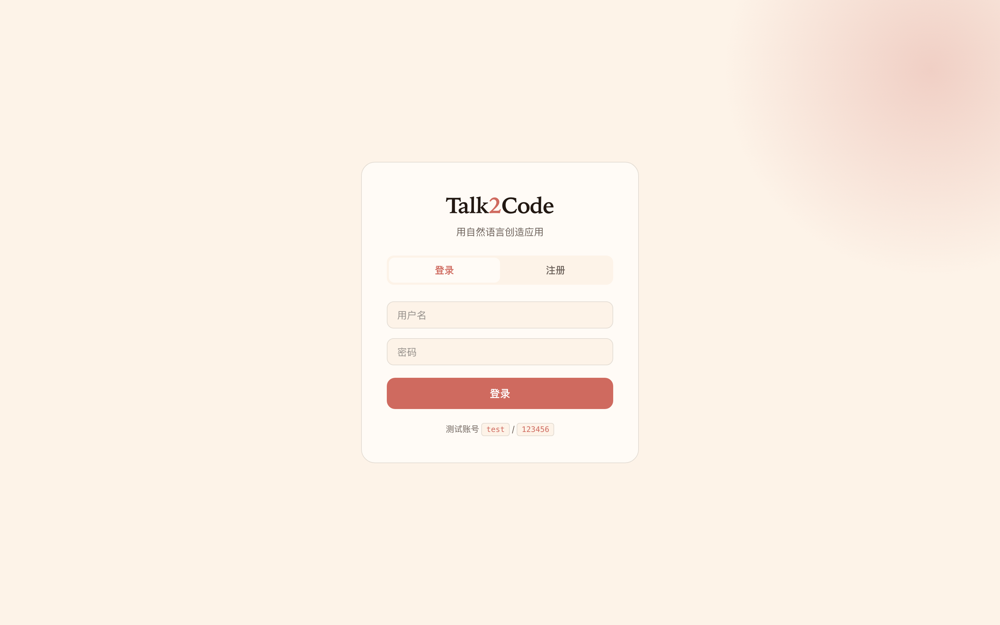

# Talk2Code

一个 AI 驱动的代码生成平台，用户输入自然语言需求 → AI 多智能体协同处理 → 实时生成可运行的产品代码。

## 技术栈

- **前端**: Vue 3 + TypeScript + Vite + Warm Soft 设计系统 (OKLch)
- **后端**: Python 3.11+ + Flask
- **数据库**: SQLite
- **实时通信**: SSE (Server-Sent Events)
- **认证**: JWT
- **AI 编排**: LangGraph + LangChain
- **AI 模型**: 兼容 OpenAI/Anthropic 接口协议，配置驱动切换

## 项目结构

```
talk2code/
├── backend/
│   ├── app.py                          # Flask 主程序（API 路由、SSE 推送）
│   ├── config.py                       # Pydantic 配置（数据库、JWT、SSE、LLM）
│   ├── requirements.txt                # Python 依赖
│   ├── .env.example                    # LLM 配置模板
│   ├── models/                         # SQLAlchemy 数据模型 + Schema
│   ├── llm/
│   │   └── client.py                   # 统一 LLM 客户端（OpenAI/Anthropic 双协议）
│   ├── harness/                        # Agent 运行时框架（6 层架构）
│   │   ├── runtime.py                  # ReAct 工具调用循环 — Agent 执行引擎
│   │   ├── graph.py                    # LangGraph 工作流定义
│   │   ├── instructions/               # 提示词模板、节点函数、意图路由、角色执行、上下文组装/压缩
│   │   │   ├── intent_router.py         #   前置意图分类 (QUICK/SEARCH/TASK/AMBIGUOUS)
│   │   │   ├── prompts.py               #   TeamLeader/FrontendEngineer 提示词模板
│   │   │   ├── nodes.py                 #   TeamLeader/FrontendEngineer 节点函数（含复杂度评估）
│   │   │   ├── orchestrator.py          #   多角色编排引擎
│   │   │   ├── role_executor.py         #   单一角色执行器
│   │   │   ├── assembler.py             #   上下文组装（Skill + Craft 规则 + 记忆）
│   │   ├── tools/                      # 工具注册表、文件操作、代码生成/验证
│   │   ├── roles/                      # 多角色定义
│   │   │   ├── __init__.py              #   Role/RoleResult/RoleRegistry
│   │   │   └── definitions.py           #   5 角色 Prompt + 工具子集 + 路由表
│   │   ├── communication/               # 消息总线
│   │   │   └── __init__.py              #   AgentBus 四分支路由
│   │   ├── experience/                  # 经验池
│   │   │   └── __init__.py              #   ExperiencePool + TF-IDF 检索
│   │   ├── learning/                    # 持续学习
│   │   │   └── __init__.py              #   Evaluator + FeedbackLoop
│   │   ├── environment/                # 权限管理、沙箱执行
│   │   ├── state/                      # AgentState、WorkspaceFS、Git 版本化、记忆存储
│   │   ├── constraints/                # Hook 管理器 + 约束检查（Craft 规则、安全、质量）
│   │   └── observability/              # 链路追踪、成本统计、SSE 事件上报、日志
│   ├── agents/                         # 向后兼容重导出层
│   ├── services/                       # SSE 传输、任务调度、应用胶水层
│   ├── skills/                         # 可插拔应用模板（Skill 定义）
│   └── utils/                          # 限流、重试、安全、SSE 格式化
├── frontend-vue/                       # Vue 3 + TypeScript 前端
│   ├── src/
│   │   ├── components/                 # 组件（auth/common/detail/history/home/layout/settings）
│   │   ├── views/                      # 页面视图
│   │   ├── composables/                # 组合式函数（useApi/useSSE/useDarkMode/useToast）
│   │   ├── stores/                     # Pinia 状态管理（auth/requirement/settings）
│   │   └── router/                     # Vue Router 路由
│   └── dist/                           # 构建产物（由 Flask 托管）
├── start.sh                            # 一键启动脚本
└── openspec/                           # OpenSpec 规范驱动开发
```

## 快速开始

### 1. 安装依赖

```bash
python -m venv venv
source venv/bin/activate
pip install -r backend/requirements.txt
```

### 2. 配置 LLM

复制配置模板并填入你的 API Key：

```bash
cp backend/.env.example backend/.env
# 编辑 backend/.env，填入 LLM_API_KEY
```

支持两种协议，通过 `LLM_PROVIDER` 切换：

| 协议 | 适用服务商 |
|------|-----------|
| `openai_compatible` | DeepSeek、DashScope、OpenAI、智谱、月之暗面 等 |
| `anthropic_compatible` | Anthropic Claude 等 |

```bash
# OpenAI 兼容示例（DeepSeek）
LLM_PROVIDER=openai_compatible
LLM_BASE_URL=https://api.deepseek.com
LLM_MODEL=deepseek-v4-flash
LLM_API_KEY=your-api-key-here
```

### 3. 启动服务

**方式一：一键启动**

```bash
./start.sh
```

**方式二：手动启动**

```bash
# 构建前端
cd frontend-vue && npm install && npm run build && cd ..

# 启动后端
cd backend && python app.py
```

访问 http://localhost:5001

### 4. 测试账号

- 用户名：`test`
- 密码：`123456`

## 使用流程

1. **登录** - 使用测试账号或注册新账号
2. **输入需求** - 在首页输入框输入你的需求
   - 开发任务示例：`开发一个待办清单 App，支持增删改查`
   - 简单问答示例：`什么是 CSS Grid 布局？`（AI 直接回答，不触发代码生成）
   - 代码示例：`写一个冒泡排序函数`
3. **意图分流**（自动）- AI 判断用户意图：
   - 常识问答/代码解释 → 秒级直接回复
   - 开发任务 → 进入 TeamLeader → FrontendEngineer 生成流水线
   - 模糊需求 → 自动生成澄清问题表单
4. **查看生成** - 进入详情页：
   - **左侧**: AI 对话面板 — 观看 TeamLeader → FrontendEngineer 协同讨论，底部输入框可继续对话
   - **右侧**: 代码/预览面板 — 文件树 + 代码编辑器 + 设备预览（桌面/平板/手机）
5. **持续对话** - 生成完成后，可在对话面板底部继续与 AI 交互，做增量修改或提问
6. **历史管理** - 在「历史对话」页面查看所有项目，支持搜索、状态筛选、回收站

## 核心功能

### 用户系统
- 用户注册/登录（JWT 认证）
- 登录状态持久化
- 未登录拦截

### AI 智能体协同

基于 **LangGraph** 实现的工作流编排，前置意图分类器做四路分流：

```
用户输入
  │
  └─ IntentRouter (前置分流)
       ├─ QUICK     → LLM 直接回答（常识问答/代码解释/问候）
       ├─ SEARCH    → 增强回答 + 时效性提示
       ├─ AMBIGUOUS → 澄清表单，引导用户补充信息
       └─ TASK      → 进入生成流水线
                         │
                         ├─ TeamLeader (需求分析 + 复杂度评估)
                         │    └─ 输出: features, complexity[XS|S|M|L], tech_stack, ...
                         │
                         ├─ XS/S: 直接 FrontendEngineer (单角色，等同 v2.2)
                         │
                         └─ M/L: 多角色协作
                              │  AgentBus 消息总线 (四分支路由)
                              ├─ ProductManager (Alice) — PRD 生成
                              ├─ Architect (Bob) — 架构设计
                              ├─ FrontendEngineer (Alex) — 代码生成
                              └─ QAReviewer (David) — 审查 + 修复循环
                                    │
                                    ▼ ExperiencePool
                                      成功案例→few-shot注入 | 失败案例→警告注入
```

| 组件 | 职责 |
|------|------|
| **IntentRouter** | 前置意图分类（QUICK/SEARCH/TASK/AMBIGUOUS），轻量 LLM 调用（~200 tokens），非开发请求直接返回 |
| **TeamLeader** | 需求分析+复杂度评估+调度中枢：XS/S 直接派给 Engineer，M/L 按 SOP 路由 PM→Arch→Engineer→QA，收集产出、整合汇报 |
| **ProductManager** | 需求分析、PRD 生成（功能清单、数据模型、交互流程），M/L 流程第一步 |
| **Architect** | 技术选型、组件树设计、数据流设计、文件结构规划，M/L 流程第二步 |
| **FrontendEngineer** | 代码生成（write_file/edit_file）、验证修复。XS/S 单角色全权负责，M/L 基于 PM+Arch 上下文编码 |
| **QAReviewer** | M/L 复杂度下的代码审查：5 维度评分 + 问题识别 + 修复建议，触发 Engineer 修复循环 |
| **AgentBus** | 消息总线：四分支路由解耦角色通信，统一 SSE 推送，消息历史可追溯 |
| **ExperiencePool** | 经验池：TF-IDF 语义检索成功案例作为 few-shot，失败案例生成警告，越用越好 |

**复杂度自适应行为**：

| 维度 | XS（极简） | S（标准） | M（多功能） | L（复杂） |
|------|-----------|----------|------------|----------|
| 典型场景 | 个人主页、计数器 | 待办清单、番茄钟 | 任务看板、博客 | 电商、后台系统 |
| 角色序列 | Engineer | PM → Engineer | PM → Arch → Engineer → QA | PM → Arch → Eng → QA → Eng → QA |
| 文件结构 | 自由（≥1 个文件） | 3 文件强制 | Plan 建议 + 子目录 | Plan 建议 + 多模块 |
| 最大迭代 | 5 轮 | 15 轮 | 15 轮 | 20 轮 |
| 验证深度 | 跳过 | lint + preview | lint + execute + preview | 全量验证 + QA 审查 |
| QA 修复循环 | 无 | 无 | 1 轮 | 2 轮 |

**设计原则**：
- 简单需求快速产出（XS/S 单角色），复杂需求多角色协作保证质量（M/L）
- 角色间通过 AgentBus 消息总线通信，四分支路由解耦
- 每次成功/失败自动存入 ExperiencePool（TF-IDF 语义检索），后续相似需求注入 few-shot 示例
- 越用越好：经验池积累 → Prompt 自动增强 → 生成质量持续提升
- 所有角色的行为规则写在其 System Prompt 中，改行为 = 改 Prompt，无需改代码
- 同一 LLM 实例切换 System Prompt 实现角色分化，无需额外模型部署

### Harness 框架

Agent 运行时，统一管理 AI 智能体全生命周期。

```
IntentRouter → TeamLeader → RoleOrchestrator (AgentBus)
                                └─ ExperiencePool ← FeedbackLoop
```

| 层级 | 模块 | 职责 |
|------|------|------|
| 0 - Routing | `intent_router.py` | 前置意图分类，四路分流 |
| — | `communication/` | AgentBus 消息总线，四分支路由 |
| 1 - Instructions | 提示词/角色/编排 | TeamLeader/FrontendEngineer 节点、角色定义、编排引擎 |
| 2 - Tools | 工具注册/代码生成 | 工具注册表、read/write/edit_file、验证 |
| 3 - Environment | 权限/沙箱 | 权限控制、沙箱安全执行 |
| 4 - State | 状态/工作区/记忆 | AgentState、WorkspaceFS、Git 版本化、role_history/outputs |
| 5 - Constraints | Hook/检查 | Hook 管理器 + Craft 规则/安全/质量 + QA 集成 |
| 6 - Observability | 追踪/成本/上报 | 链路追踪、Token 成本统计、SSE |
| — | `experience/` | TF-IDF 语义检索 + 经验存储 |
| — | `learning/` | Evaluator 评分分析 + FeedbackLoop 回灌 |

### 设计质量规则（Craft 层）

系统在代码生成时自动注入设计质量约束：

- **anti-ai-slop**: 避免 AI 刻板模式（默认 indigo 色系、emoji 图标、圆角卡片+彩色左边框等）
- **accessibility-baseline**: 颜色对比度、键盘导航、语义化 HTML、ARIA 标签
- **typography**: 字号层级、行高、字距、行宽、字体配对
- **color**: 色板结构、主色纪律、语义色、暗色主题

### 可插拔应用模板（Skill 系统）

通过 `skills/` 目录下的 Markdown 文件定义应用类型，支持关键词自动匹配：

- 待办清单、计算器、笔记、日历、通用应用
- 新增应用类型只需添加 `skills/<name>/SKILL.md`，无需修改代码

### 交互式需求澄清

- 需求过短或缺少功能关键词时，AI 自动生成结构化问题表单
- 用户补充后重新进入生成流程，最多 1 轮澄清

### 增量编辑

- 生成完成后支持持续对话（Chat 模式），AI 通过 `edit_file` 工具做精确增量修改
- 基于 search-replace 协议，避免重写整个文件

### 需求回收站

- 软删除机制：删除的需求进入回收站，`30 天后`自动清理
- 支持恢复操作
- 历史页面可通过 Tab 切换查看正常需求 / 回收站

## 界面预览

### 登录页面


### 首页


### 需求详情页（代码视图）


### 需求详情页（预览视图）


### 历史对话


### 设置


**页面说明**:
- **登录页**: Warm Soft 暖色设计，登录/注册双 Tab 切换，测试账号提示
- **首页**: 自然语言输入框 + 示例需求快捷填入
- **详情页**: 左侧气泡式 AI 对话（TeamLeader → FrontendEngineer 协同），右侧代码/预览面板（文件树 + 代码编辑器），支持桌面/平板/手机设备预览
- **历史对话**: 项目列表 + 实时搜索 + 状态筛选 + 回收站 Tab
- **设置**: 个人资料/外观偏好/关于 分区设置

## 架构总览

```
用户输入 → IntentRouter (四分流)
  ├─ QUICK/SEARCH → 秒级回复
  └─ TASK → TeamLeader (分析 + 复杂度 + 调度)
              ├─ XS/S → FrontendEngineer 单角色编码
              └─ M/L → AgentBus 消息总线
                        ├─ ProductManager (PRD)
                        ├─ Architect (架构设计)
                        ├─ FrontendEngineer (编码)
                        └─ QAReviewer (审查 + 修复闭环)
                              │
                              ▼
                        ExperiencePool ← FeedbackLoop
                        成功案例→few-shot   失败→警告
```

项目仍在积极迭代中，欢迎 Issue / PR 一同共创。

## 注意事项

1. 项目仍在迭代中，欢迎 Issue / PR 一同共创
2. 需要在 `.env` 中配置 `LLM_API_KEY` 才能使用 AI 功能
3. 生产环境请配置 `JWT_SECRET_KEY`、`LLM_API_KEY` 等敏感信息
4. 建议使用现代浏览器（Chrome/Edge/Safari）
5. LangGraph 工作流支持错误降级和 fallback 机制
6. 前端开发模式：`cd frontend-vue && npm run dev` 启动 Vite 热更新开发服务器
