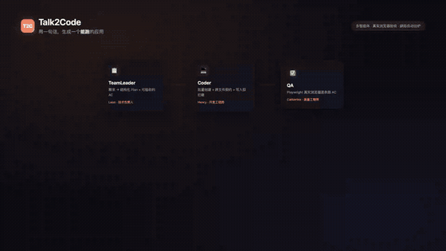
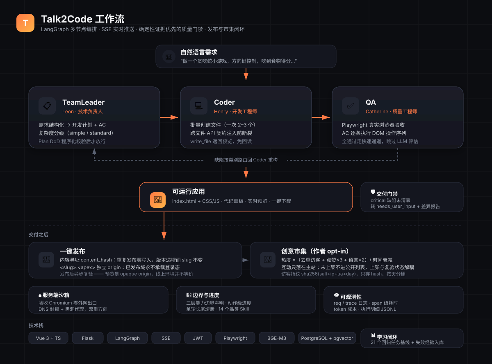

> [English](README.en.md) · 中文

<p align="center">
  
</p>

<h1 align="center">Talk2Code</h1>

<p align="center">
  <b>用一句话，生成一个能跑、能发布、能被人看到的应用。</b>
</p>

<p align="center">
  输入自然语言需求 → AI 多智能体协同（需求分析 / 编码 / 真实浏览器验收）→ 一键发布到独立子域 → 可选上架创意市集。
</p>

<p align="center">
  <a href="https://wowcoder.github.io/talk2code/"></a>
  <a href="https://github.com/WowCoder/talk2code/actions/workflows/ci.yml"></a>
  
  
  
  
</p>

<p align="center">
  
</p>

<p align="center">
  🌐 <a href="https://wowcoder.github.io/talk2code/"><b>项目主页（含完整演示视频）</b></a>
  &nbsp;·&nbsp; 🎬 <a href="https://github.com/WowCoder/talk2code/blob/main/docs/talk2code_pitch.mp4">观看高清视频（MP4）</a>
</p>

## ✨ 特性

| | |
|---|---|
| 🗣️ **说人话就能出活** | 一句需求 → 多智能体协同产出可运行、可下载的应用 |
| 🤖 **三个角色分工** | 技术负责人定方案、开发工程师写代码、质量工程师真机验收 |
| ✅ **真实验收** | Playwright 在真实浏览器里逐条跑验收条件，不是「看着像对的」 |
| 🚦 **交付门禁** | 关键缺陷清零才放行，杜绝「能跑就行」 |
| 🚀 **一键发布** | 产物直接变成可分享的独立子域链接，发布后在新环境重跑验收 |
| 🛒 **创意市集** | 作者同意即可上架公开列表，去重访客 + 加权热度排序 |
| 🔁 **越用越聪明** | 21 个回归任务 + 跨会话记忆，踩过的坑不再踩 |

## 🛠 技术栈

Vue 3 + TypeScript + Vite · Python 3.11+ / Flask / LangGraph · PostgreSQL + pgvector（未配置则回退 SQLite）· Redis + Celery · SSE 实时推送 · JWT 认证 · Playwright + headless Chromium

## 🏗 架构

<p align="center">
  
</p>

三个 LangGraph 节点（TeamLeader → Coder → QA）构成生成主线，交付后接一键发布与创意市集；上下文管线、记忆系统、运行时沙箱与可观测性横切全程。

## 🚀 快速开始

```bash
git clone https://github.com/WowCoder/talk2code.git && cd talk2code

python -m venv venv && source venv/bin/activate
pip install -r backend/requirements.txt

cp backend/.env.example backend/.env      # 填入 LLM_API_KEY
docker compose up -d                      # 可选：PG + Redis，不配则自动回退 SQLite

./start.sh                                # → http://localhost:5001
```

- **LLM 接入**：`LLM_PROVIDER` 支持 `openai_compatible`（DeepSeek / DashScope / OpenAI / 智谱 / 月之暗面等）与 `anthropic_compatible`，配置驱动切换。
- **首次进入**：`python manage.py demo init` 创建演示帐号后以演示模式只读进入；或注册（需邀请码，可在登录页申请）。演示态的写操作由后端守卫默认拒绝。
- **运营后台**：`python manage.py admin create-user --username <u>`，入口 `/admin/login`。

## 📁 项目结构

```
talk2code/
├── backend/
│   ├── app.py / factory.py / config.py / manage.py
│   ├── routes/          # auth / requirements / preview / market / publish / invite / admin
│   ├── models/          # users / requirements / published_* / site_* / invite_codes ...
│   ├── llm/             # 统一 LLM 客户端（OpenAI / Anthropic 双协议）
│   ├── harness/         # Agent 运行时：instructions / tools / state / constraints / observability
│   └── services/        # publish / market / notify / invite / sse / task_queue
├── frontend-vue/        # Vue 3 + TypeScript 前端（views / components / stores / composables）
├── eval/                # 21 个回归任务与 CI 质量基线
├── docker-compose.yml   # PostgreSQL(pgvector) + Redis
└── openspec/            # OpenSpec 规范驱动开发记录
```

## 🧩 核心能力

**多智能体工作流** — 技术负责人分析需求并判断复杂度，开发工程师批量写代码，质量工程师用 Playwright 在真实浏览器里逐条跑验收条件；没通过就按缺陷类型打回重做。简单需求走快速通道，复杂需求先给出方案和验收条件再动手。

**一键发布** — 产物按内容哈希存储，内容没变就不重复写入、分享链接保持不变；每个站点跑在自己的独立域名上，避免生成的代码读到主站登录态；发布后会用真实链接再验一遍，失败就明确标记，绝不假装成功。

**创意市集** — 默认不公开，只有作者自己点了「公开」才会出现在市集里，发布后的自动复验没通过也不影响公开。热度 =（当天去重访客 + 点赞×3 + 留言×2）÷ 时间衰减，同一访客当天只算一次；点赞和留言都在主站进行，发布出去的站点只留一个跳转回来的角标。

**工程质量** — 写入文件前自动拦掉在预览环境里必然跑不起来的写法（ES Module、外部 CDN 脚本等）；跨文件引用的函数会校验是否真的导出；需要后端的需求会在澄清阶段讲清能做什么，并给出照样能交付的替代方案；进度播报到具体动作（「正在创建 js/app.js」「已完成 2/4」）。

实现细节见 [架构与设计](docs/ARCHITECTURE.md)。

## ⚠️ 使用注意

1. 必须配置 `LLM_API_KEY` 才能使用 AI 功能。
2. **JWT 密钥**：生产环境需配置强随机 `JWT_SECRET_KEY`。使用默认密钥且服务对外可达时应用拒绝启动，仅限隔离演示环境设 `ALLOW_INSECURE_SECRETS=true` 豁免。
3. **反向代理**：未部署在可信反向代理之后时请勿开启 `TRUST_PROXY_HEADERS=true`，否则限流 IP 可被伪造。
4. **注册准入**：默认需邀请码（一次性、7 天有效）。内测期可用 `python manage.py invite create --count N` 应急发码，或走「申请 → 后台审批」链路。
5. **发布能力**：`PUBLISH_APEX` 为空时发布接口返回 warnings，前端提示「链接不可用」而不会给出打不开的地址。
6. **排查入口**：`backend/logs/` 下 `app` / `agent` / `llm` / `llm_traffic`（JSON Lines，按天轮转 7 天）/ `agent_exec`（需 `AGENT_EXEC_LOG=true`，排查「Agent 反复读同一文件却不出活」的首选）。

## ✅ 质量保障

`eval/tasks/tasks.yaml` 固化 21 个回归任务，覆盖历史上真实踩过的坑（ES Module/CORS、CDN 沙箱、跨文件导出断裂等）。PR 到 `main` 时 CI 自动跑全量 eval 并与黄金基线（20/21 = 95.2%）比对，通过率低于基线即判定质量回归。

```bash
cd backend && PYTHONPATH=. python ../eval/run_eval.py --no-preview
```

去掉 `--no-preview` 即启用真实浏览器验收：headless Chromium 加载生成页面，捕获 `pageerror` / `console_error` / `request_failed`，与静态审计构成「静态 + 运行时」双保险。

## 🗺 路线图

- **对话式迭代** — 生成完成后继续用对话微调（「把按钮换成深色」「再加一个导出 Excel 的功能」），改动落在已有代码上而不是整份重做；遇到需要取舍的地方，把选项摆出来由你拍板。
- **开放技能库** — 把内置的 14 个领域技能包开放出来，并支持编写自己的技能包，让生成结果直接贴合你的技术栈与代码规范。
- **前后端一体生成** — 从只生成前端页面，扩展到带接口与数据存储的完整应用：一句需求产出能直接跑起来的前后端代码。

## 📚 文档

| 文档 | 内容 |
|------|------|
| [docs/ARCHITECTURE.md](docs/ARCHITECTURE.md) | 当前实现说明：验收模型、交付门禁、上下文管线、记忆系统、发布与市集、沙箱、可观测性。**与代码同步维护，从这里看起** |
| [docs/design/](docs/design/) | 各模块的设计记录与决策依据，回答「为什么这么做」。属设计稿，细节可能滞后于代码 |
| [openspec/](openspec/) | OpenSpec 规范驱动开发记录 |

## License

本项目采用 [MIT License](LICENSE)。

## 贡献

欢迎 Issue / PR。涉及核心 harness 改动前，建议先跑回归基线（`eval/run_eval.py --no-preview`）做前后对照。
